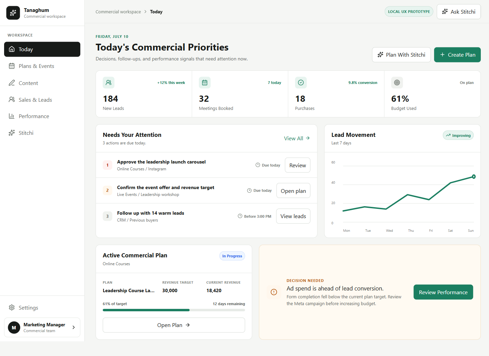
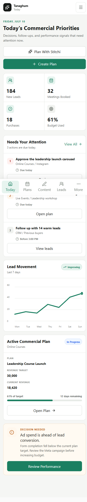
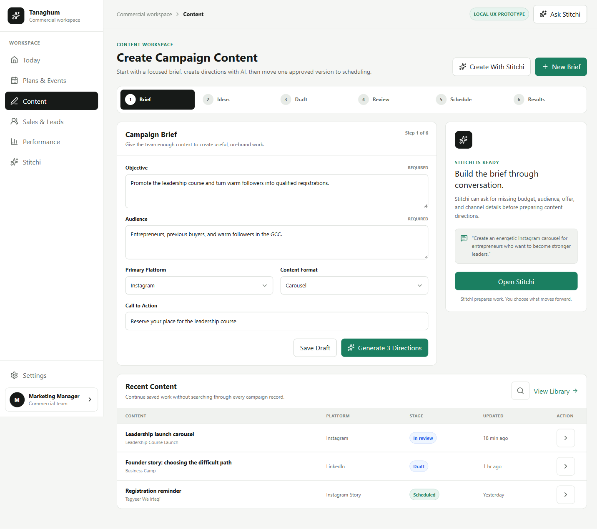
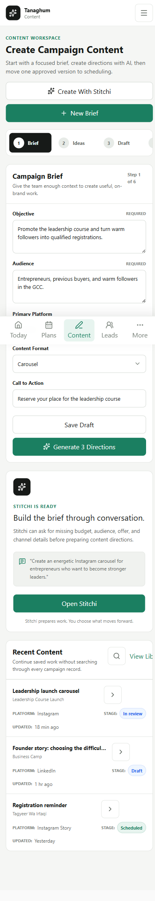
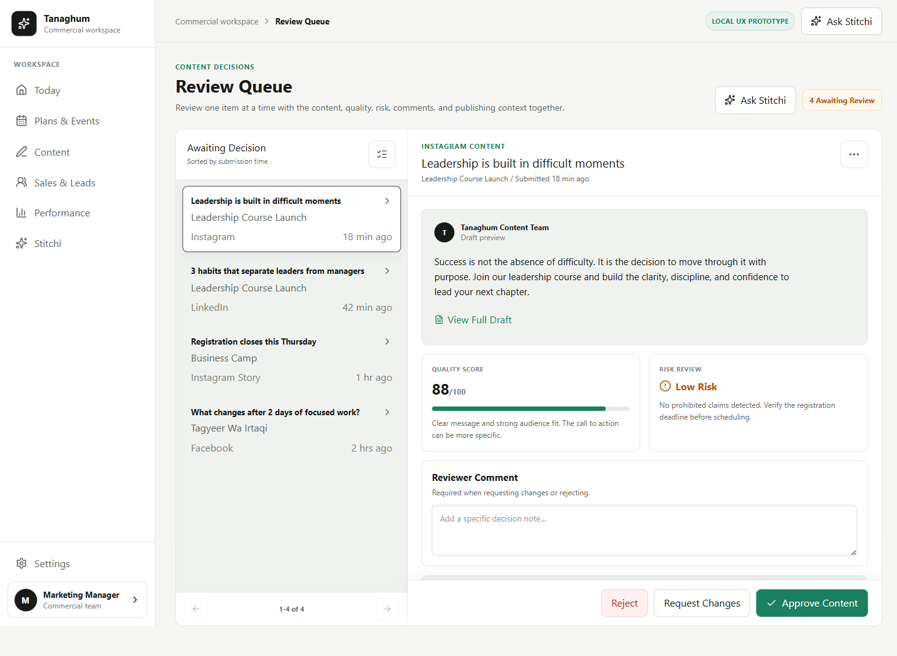
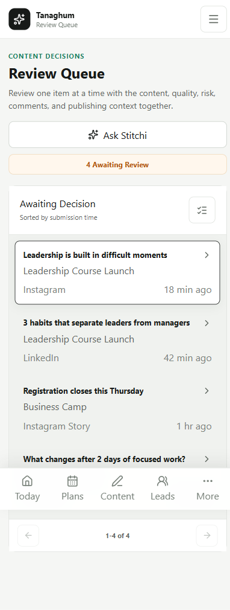
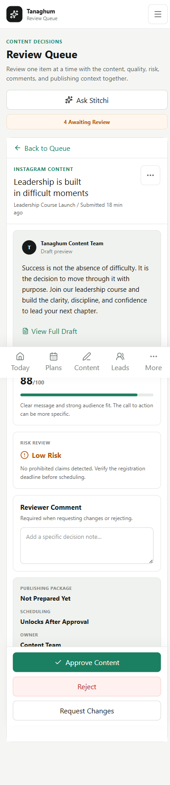
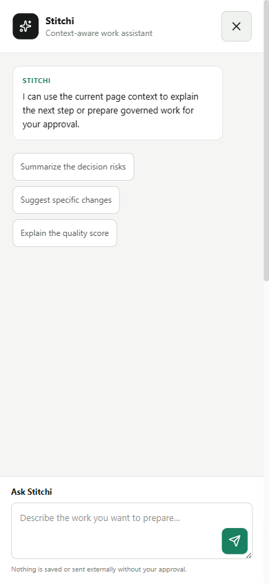

# UX-R1A Hybrid v3 Prototype Review

Status: approved visual reference, archived as screenshots. The temporary prototype routes were removed before the production Hybrid build.

Scope: Hybrid only. The A/B system and its repository were not modified.

## Purpose

This prototype tests a replacement customer workflow and shell before production implementation. It addresses the measured problems in GitHub issue #145: module-first navigation, hidden desktop navigation, long pages, clipped mobile layouts, expanded review feeds, competing design systems, and Stitchi overlays that compete with the current task.

## Review Artifact

The screenshots below are the approved UX-R1A checkpoint. Temporary static routes were used during review, then deliberately removed so sample data and preview-only code cannot ship in the customer application. UX-R1B implements the approved direction against Tanaghum APIs.

## Design Decisions

- Six customer destinations maximum: Today, Plans & Events, Content, Sales & Leads, Performance, and Stitchi.
- Setup and Admin remain separate from daily work.
- Desktop uses a persistent sidebar at 1024px and above.
- Mobile uses a compact top bar and five-item bottom navigation.
- Today begins with current priorities and meaningful commercial signals.
- Content begins with creation, then shows the connected Brief, Ideas, Draft, Review, Schedule, and Results journey.
- Review uses a bounded queue plus one selected decision context.
- Stitchi uses a bounded, context-aware sheet and never covers the current page permanently.
- Light operational surfaces carry daily work. Deep ink is limited to selection and emphasis.
- No gradients, glass panels, decorative motion, engineering jargon, or nested card stacks are used.

## Screenshots

### Today

### Content

### Review

### Stitchi

## Verification Evidence

- Frontend ESLint: passed.
- TypeScript and Vite production build: passed.
- Browser console: 0 errors and 0 warnings across the prototype routes.
- Horizontal overflow: 0px at 390, 768, 1024, 1366, and 1440 widths.
- Navigation policy: mobile navigation below 1024px; persistent desktop navigation at 1024px and above.
- Route scroll: navigating from a scrolled prototype page resets to the top.
- Stitchi: open and close behavior passed on desktop and mobile.
- Review: mobile queue to detail and back behavior passed.
- Form fields: visible labels or accessible labels present.
- Tested interactive targets: minimum 44px after correction.

## Prototype Scope At Approval

- Tanaghum API wiring and real customer data.
- RBAC-driven navigation variants.
- Production loading, empty, error, and large-list data adapters.
- Plans & Events, Sales & Leads, and Performance sample pages.
- Arabic and RTL implementation.
- Deployment to the Hybrid VPS.

UX-R1B subsequently implemented the production shell, RBAC navigation, Today, Content, and Review Queue vertical slice. Remaining page migrations continue under GitHub issue #145.
