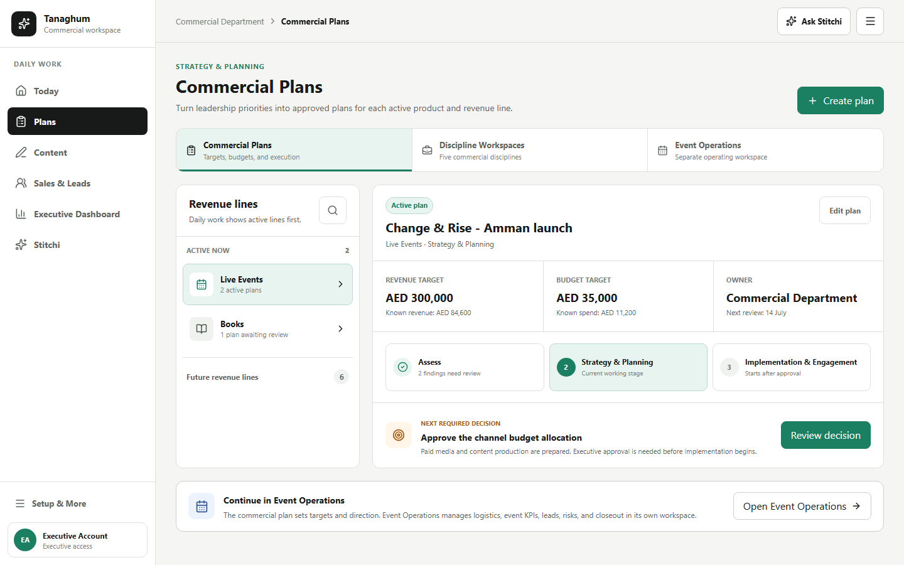
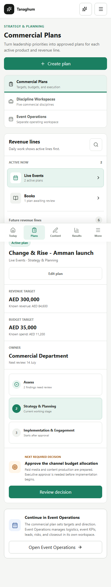
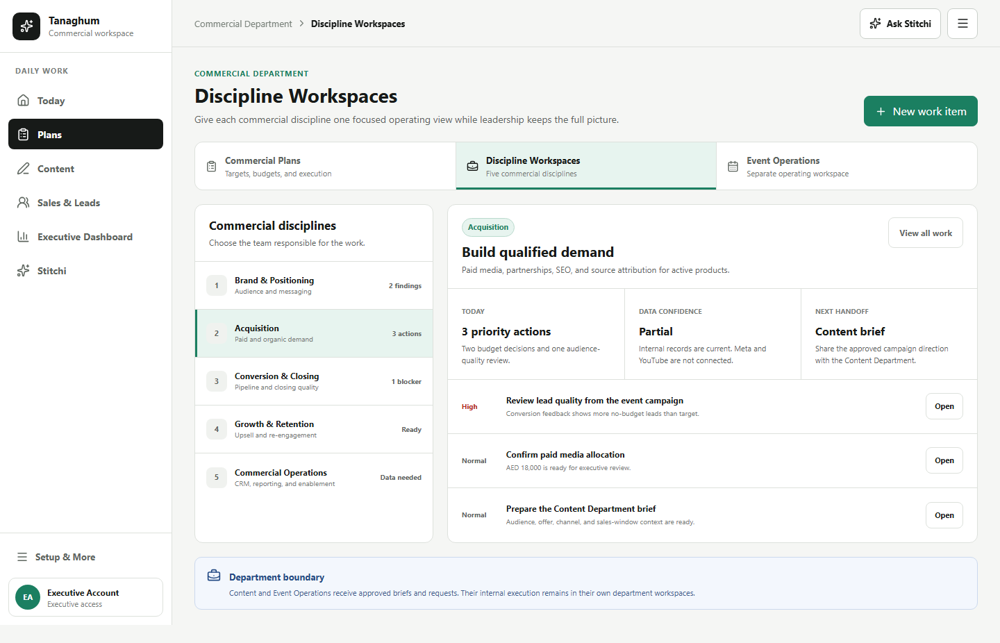
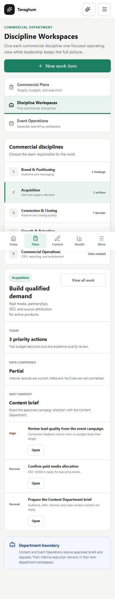
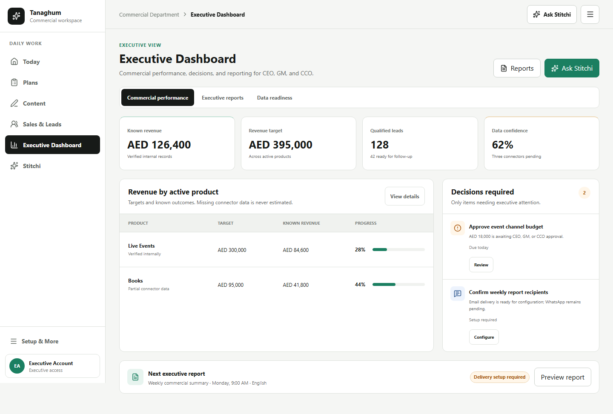
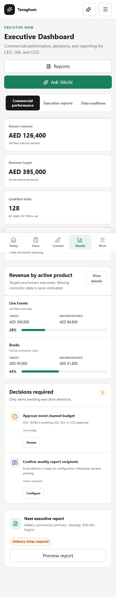
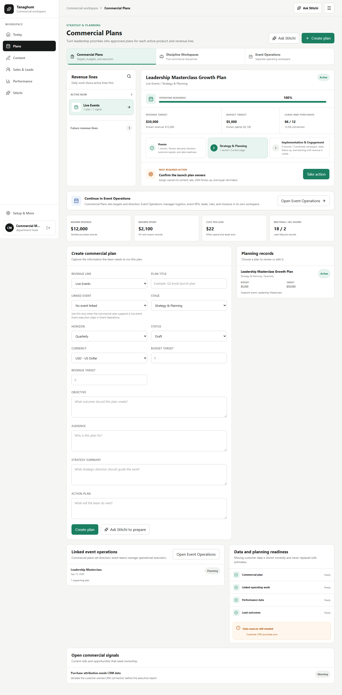
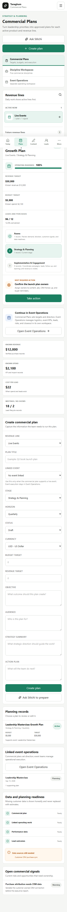
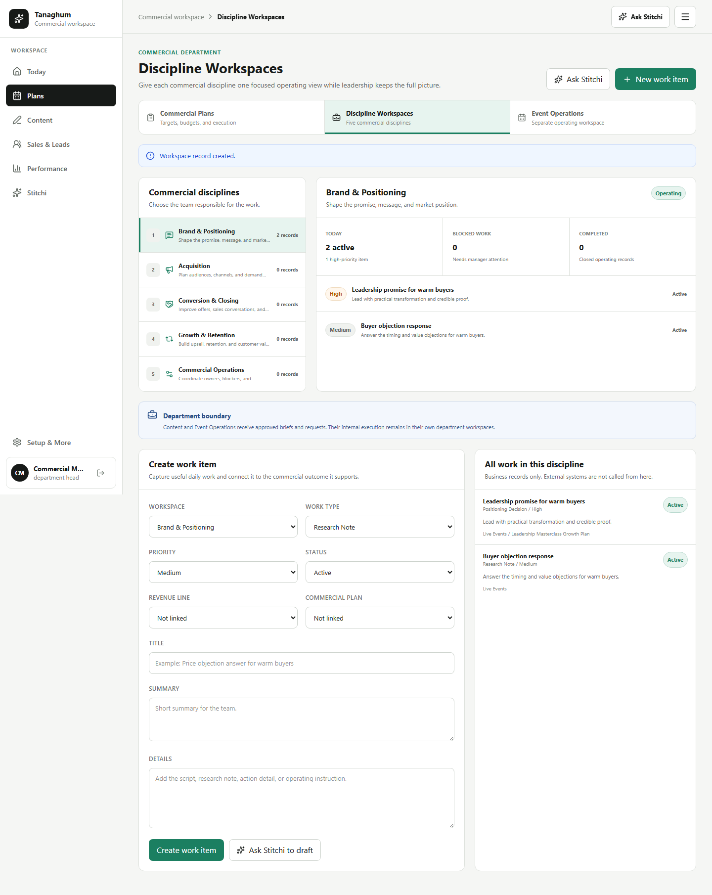
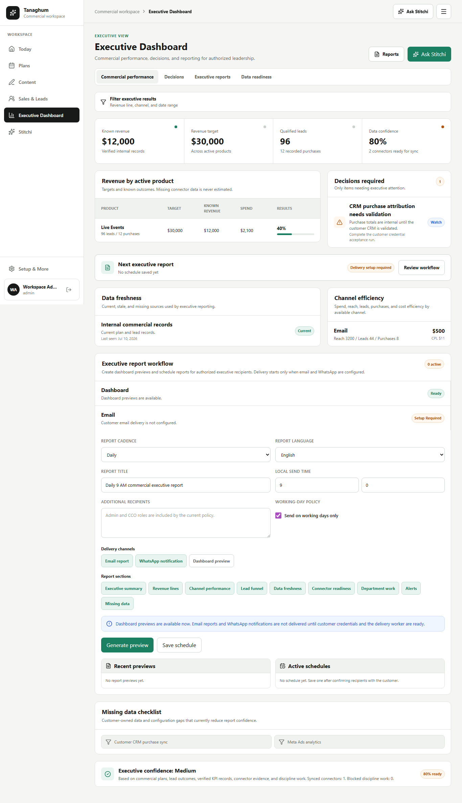

# UX-R1D1 SRD-Aligned Commercial Workspaces

Status: approved reference implemented on the real Hybrid routes. Deployment evidence is added after CI and live verification.

UX-R1D1 corrects the Hybrid information architecture while preserving Tanaghum's backend contracts, tenant isolation, role checks, audit behavior, and workflow governance.

## Product Decisions

- `Plans` is the primary customer destination for Commercial Plans.
- `Discipline Workspaces` exposes the five Commercial Department disciplines without treating them as separate top-level products.
- `Event Operations` remains a separate operating workspace reached through an explicit handoff from Commercial Plans.
- Admin and CCO roles see `Executive Dashboard`; other commercial roles continue to see `Performance`.
- Dedicated CEO and GM roles are not claimed as complete. Their final policy remains tracked in GitHub issue #140.
- The A/B system is outside this implementation and was not modified.

## SRD Alignment

- SRD Section 2: Assess, Strategy & Planning, and Implementation & Engagement remain the commercial operating model.
- SRD Section 5 and FR-6 through FR-10: five Commercial discipline workspaces remain visible and actionable.
- SRD Section 5.2 and FR-12.2: Event Operations remains outside the Commercial Department and receives linked work without being absorbed into Commercial.
- SRD Section 7 and FR-4.1 through FR-4.4: authorized executive users receive commercial metrics, decisions, data readiness, report previews, and schedule records.
- SRD FR-5.1 through FR-5.4: destinations vary by role rather than exposing all administration and executive functions to every user.

## Production Routes

- `/commercial-plans`
- `/disciplines`
- `/events`
- `/executive` for current authorized executive roles

The temporary `/ux/r1d1/*` review routes were removed before production packaging. Their approved static screenshots remain as design-decision evidence only.

## Approved Reference Screenshots

### Commercial Plans

### Discipline Workspaces

### Executive Dashboard

## Production Implementation Screenshots

These production captures use deterministic Playwright API fixtures. They prove layout and workflow wiring without representing live customer performance.

## Verification

- Frontend ESLint: passed.
- TypeScript and Vite production build: passed.
- UX-R1D1 authenticated production suite: 3/3 passed.
- Commercial SRD workflow regression: passed.
- UX-R1B shell and role regression: passed.
- Browser console errors: zero in tested paths.
- Failed or unauthorized API responses: zero in tested paths.
- Horizontal overflow: zero at 390, 768, 1024, 1366, and 1440 pixels in the approved and production walkthroughs.
- Manager flow: plan creation and linked discipline record creation passed.
- Executive flow: role-gated dashboard, decisions, missing-data truth, and report workflow passed.

## Honest Remaining Scope

- GitHub issue #145 remains open for the wider Hybrid UX program beyond these four routes.
- Dedicated CEO/GM role policy remains unresolved in issue #140.
- Customer-owned integrations still require customer credentials and live acceptance evidence.
- The existing Vite bundle-size advisory remains and should be handled by a dedicated code-splitting sprint.
