# UX-R1D2 Event Operations And Sales & Leads Reference

Status: **reference approved; production wiring and local regression complete; GitHub review and Hybrid deployment pending**.

Tracking: [GitHub issue #150](https://github.com/tamerabuhalaweh/Tanaghom/issues/150), child delivery slice of [UX-R1 #145](https://github.com/tamerabuhalaweh/Tanaghom/issues/145).

## Scope Guardrails

- Hybrid only.
- The AB reference application was not modified or deployed.
- Production implementation applies to `/events` and the Sales & Leads routes only.
- Reference routes use static, customer-safe examples and do not call Tanaghum APIs.
- Screenshot approval was received before production implementation began.
- The approved implementation must preserve existing event, lead, GHL, SmartLabs, audit, tenant, RBAC, and governed-handoff behavior.

## Why This Slice Exists

The current Event Operations page contains valuable capabilities, but repeats orientation, status, and guidance across a permanent event rail, large tabs, a separate tab guide, and nested overview panels. The selected task appears too late.

The current Sales & Leads page opens as `Performance`, displays analytics before sales work, places a large manual lead form before the lead queue, and requires extensive scrolling before a user can select and act on a customer.

UX-R1D2 changes the workflow structure, not just the colors:

- Event Operations becomes one selected event, a compact operating summary, one tab row, and one active task surface.
- Sales & Leads opens on a bounded pipeline and one selected customer.
- Add Lead becomes a secondary action.
- Performance and Data Readiness remain available as explicit views instead of blocking daily follow-up.
- Mobile Sales & Leads uses list -> detail -> back behavior.

## Reference Routes

The temporary `/ux/r1d2/events` and `/ux/r1d2/sales` routes were removed after approval. They will not ship in the customer application.

## Before Evidence

### Current Event Operations

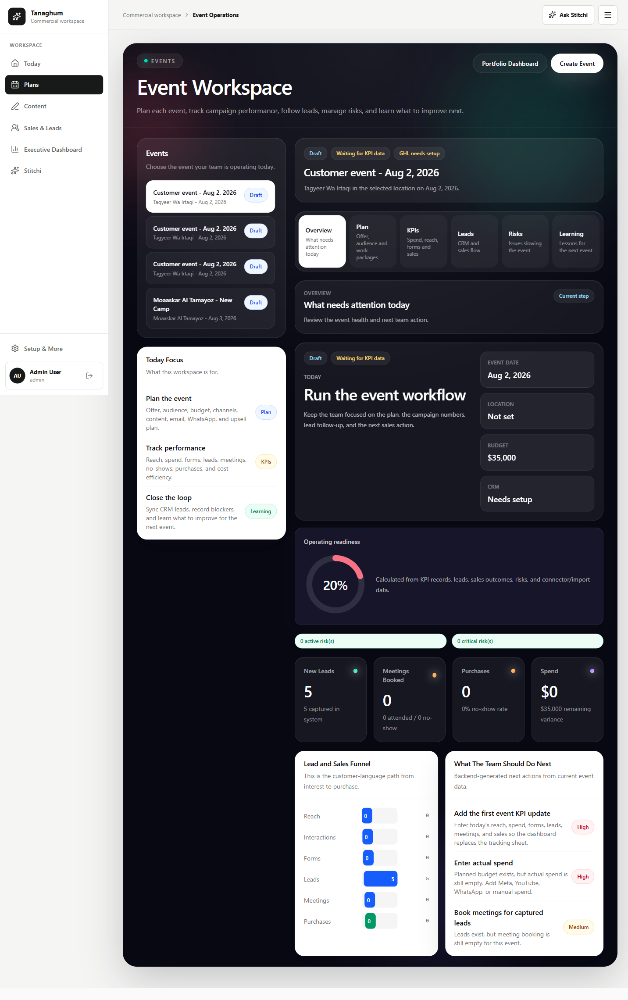

### Current Sales And Leads

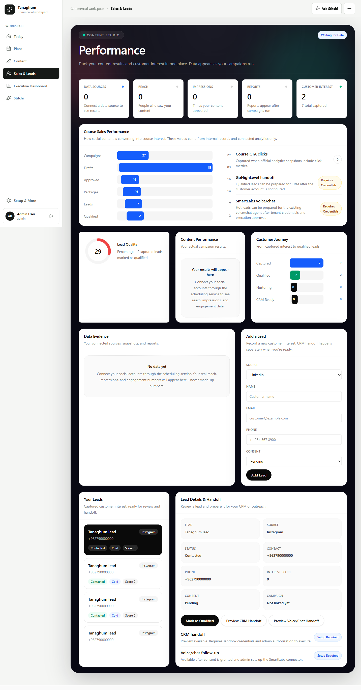

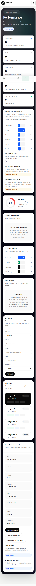

## Proposed Event Operations

### Desktop

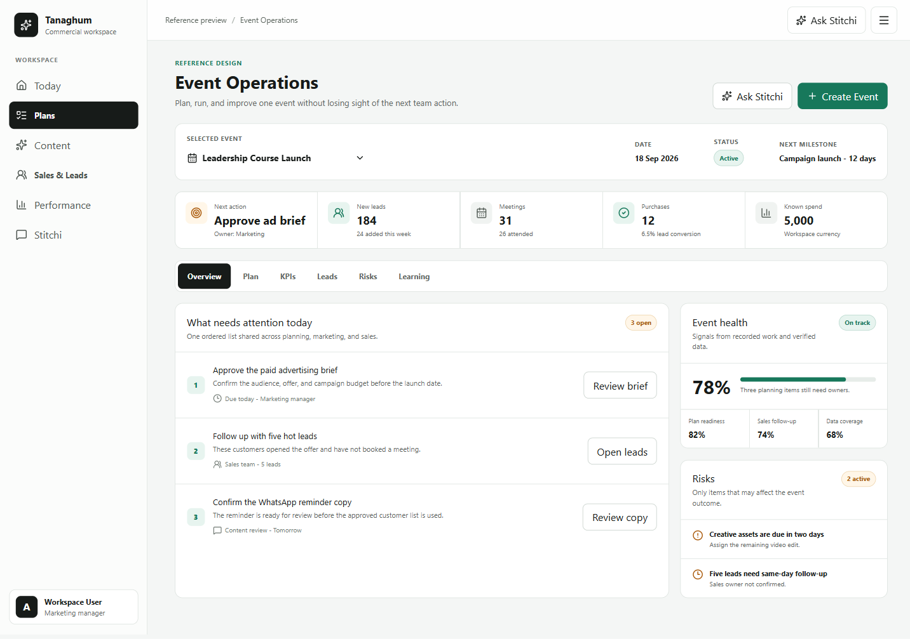

### Mobile

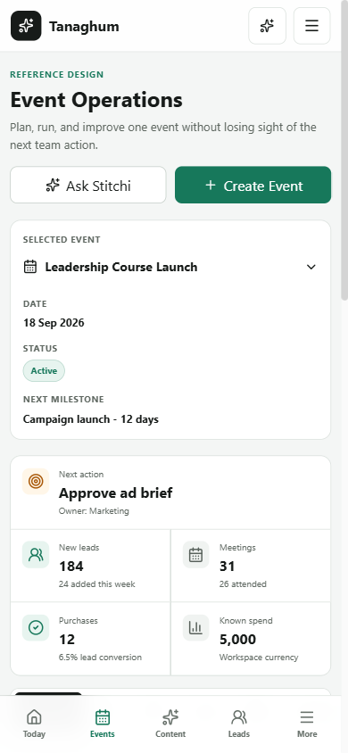

### Key Decisions

- Compact event switcher replaces the permanent event rail.
- Date, status, and next milestone appear once.
- Five operating signals fit in one bounded summary.
- Overview, Plan, KPIs, Leads, Risks, and Learning preserve the complete event lifecycle.
- Only the active tab renders its task surface.
- Today begins with ordered actions, not a decorative hero or repeated instructions.
- Event health and risks support the primary task without competing with it.

## Proposed Sales And Leads

### Desktop

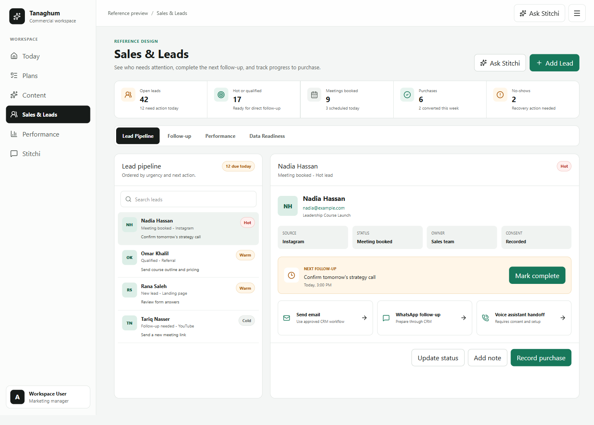

### Mobile Pipeline

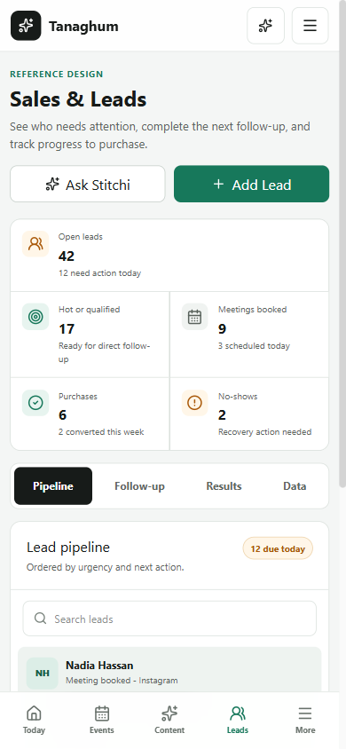

### Mobile Lead Detail

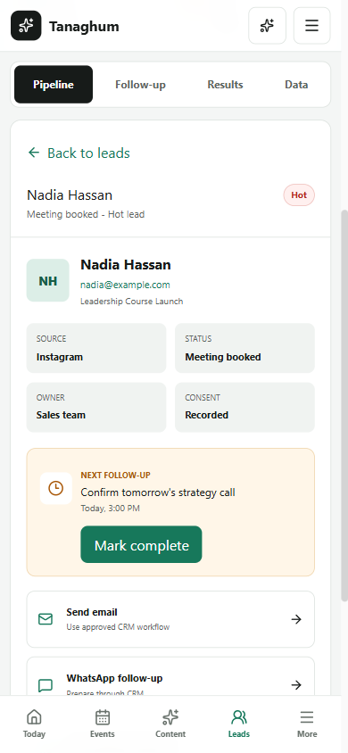

### Key Decisions

- The page title and job are consistently `Sales & Leads`.
- Daily sales signals precede reporting.
- Lead Pipeline is the default view.
- Desktop uses bounded queue plus selected detail.
- Mobile uses list -> detail -> back.
- Qualification, CRM follow-up, WhatsApp preparation, voice handoff, status, notes, and purchase actions remain in the selected-customer context.
- Follow-up, Performance, and Data Readiness are separate views.
- Manual Add Lead is available but no longer displaces the customer queue.

## Production-Wired Checkpoint

The approved information architecture has now been adapted to existing Tanaghum APIs and role controls. These screenshots come from authenticated Playwright runs with deterministic API contracts, not the static reference routes.

### Event Operations Desktop

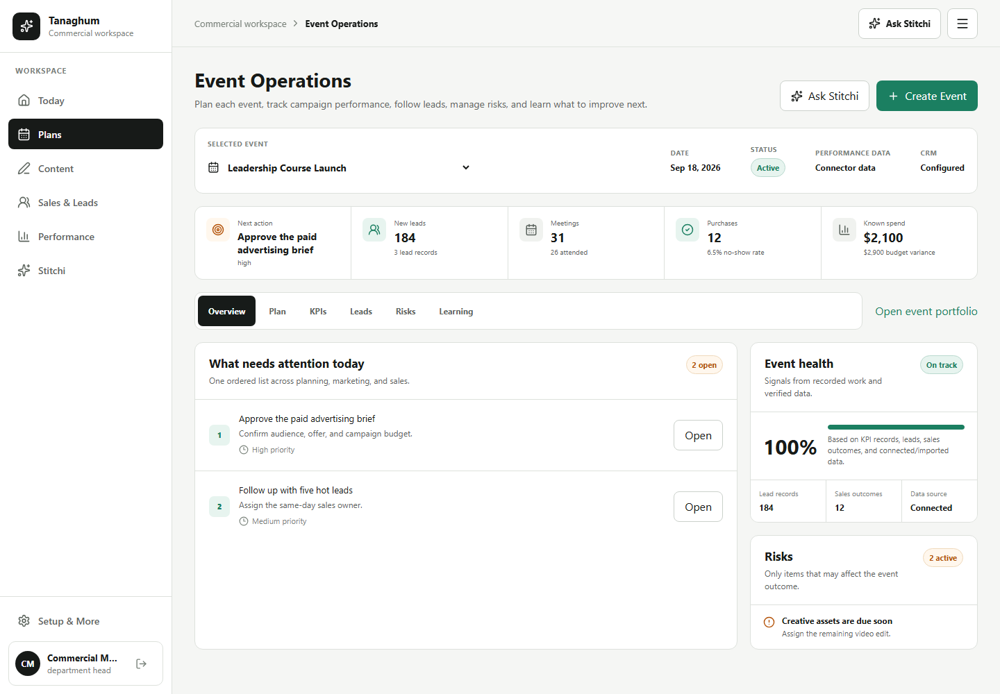

### Event Operations Mobile

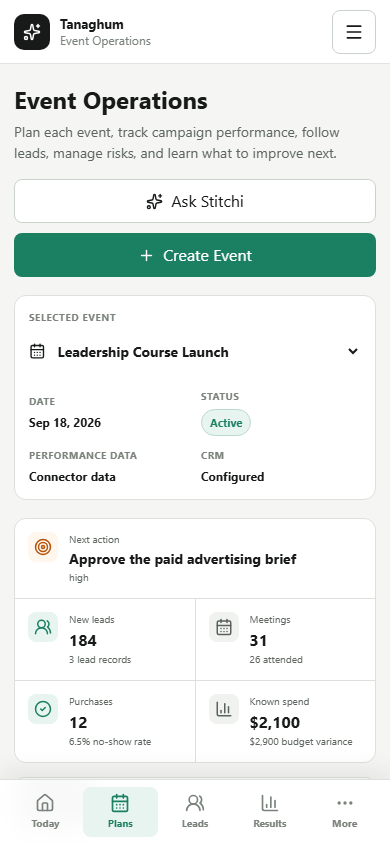

### Sales And Leads Desktop

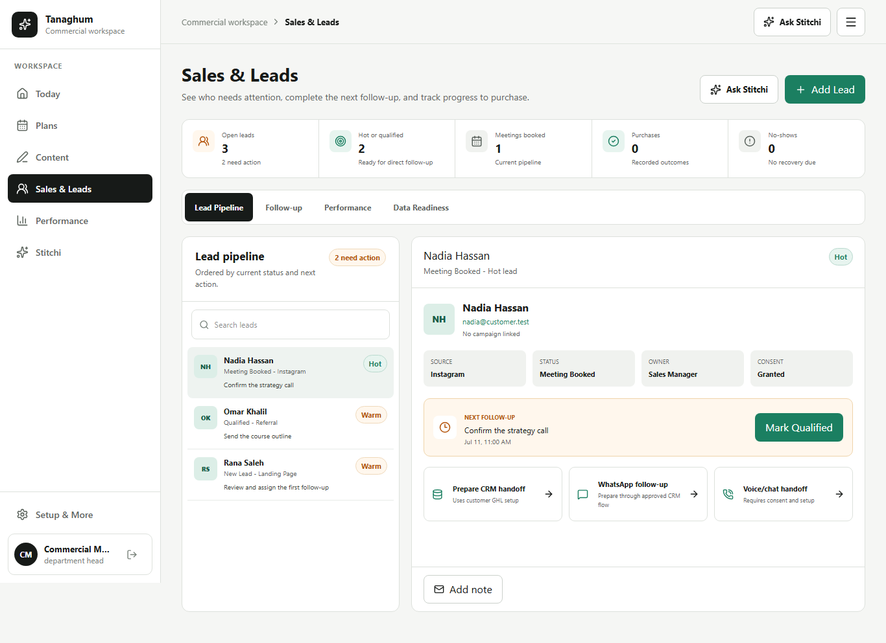

### Sales And Leads Mobile Pipeline

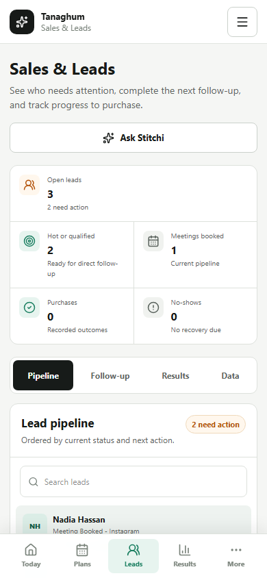

### Sales And Leads Mobile Detail

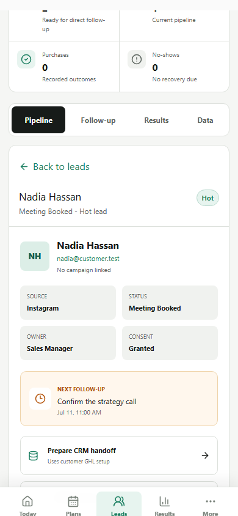

### Preserved Production Behavior

- Event list and dashboard APIs.
- Event strategy, email, WhatsApp, upsell, content-requirement, and sales-task plans.
- Verified KPI records, channel performance, CRM readiness, risks, closeout, and learning recommendations.
- Lead list, lead creation, qualification, and role-controlled mutation visibility.
- GoHighLevel handoff preview with explicit no-external-send language.
- SmartLabs voice/chat handoff preview with explicit no-external-call language.
- Contextual Stitchi entry points for the selected event and sales pipeline.
- Tenant, RBAC, audit, approval, connector, and external-execution backend contracts.

## Verification Evidence

- Frontend ESLint: passed.
- TypeScript and Vite production build: passed.
- Backend ESLint and TypeScript typecheck: passed.
- Backend Vitest regression: 135 files / 1,929 tests passed.
- Complete local Playwright inventory: 28 passed / 11 environment-gated tests skipped / 0 failed.
- Playwright reference suite at approval: 10/10 passed.
- Playwright production workflow suite: 4/4 passed.
- Tested widths: 390, 768, 1024, 1366, and 1440.
- Horizontal overflow: none at all tested widths.
- Browser console errors: none during isolated reference tests.
- Browser console warnings: none during isolated reference tests.
- Tested buttons, fields, and selects: minimum 44px interaction size.
- Event tabs: Overview -> Plan -> Overview passed.
- Sales desktop: lead selection and Performance view passed.
- Sales mobile: lead selection -> detail -> back -> Performance passed.
- Customer-language guard: no sprint, acceptance-test, MCP, M5, or SAIF terms.

Current production test command:

```powershell
npx playwright test e2e/ux-r1d2-production.spec.ts
```

## Approval Gate

Reference approval is complete. Production closure still requires:

1. Full frontend and backend regression.
2. GitHub CI.
3. Merge to main.
4. Deploy Hybrid only.
5. Live role, console, network, and responsive acceptance checks.

No deployment completion claim is made until the merged Hybrid release passes live acceptance.

Known non-blocking build warning: the current frontend application bundle is 896.46 KB before gzip and still requires a separate code-splitting optimization pass.
