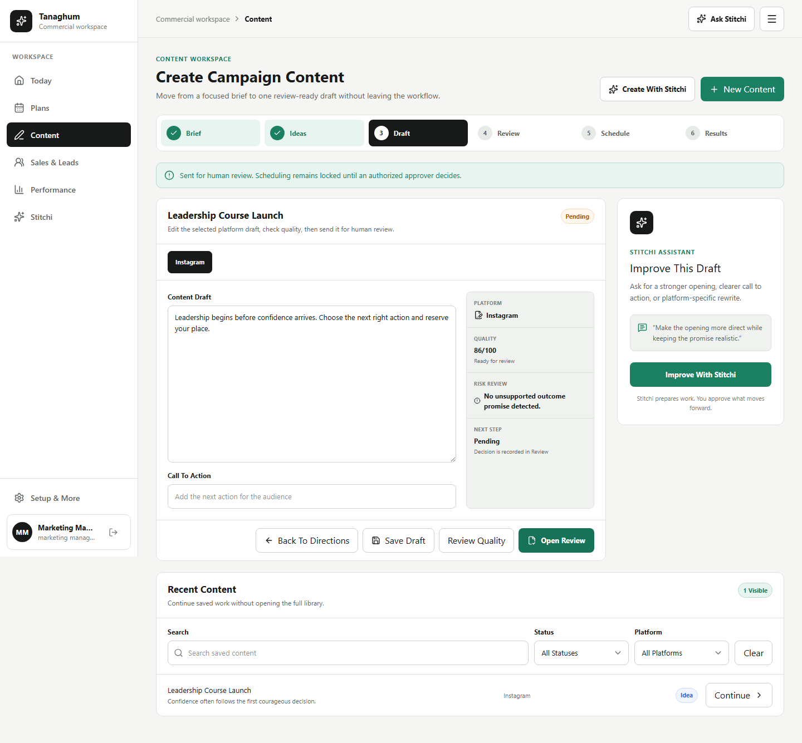
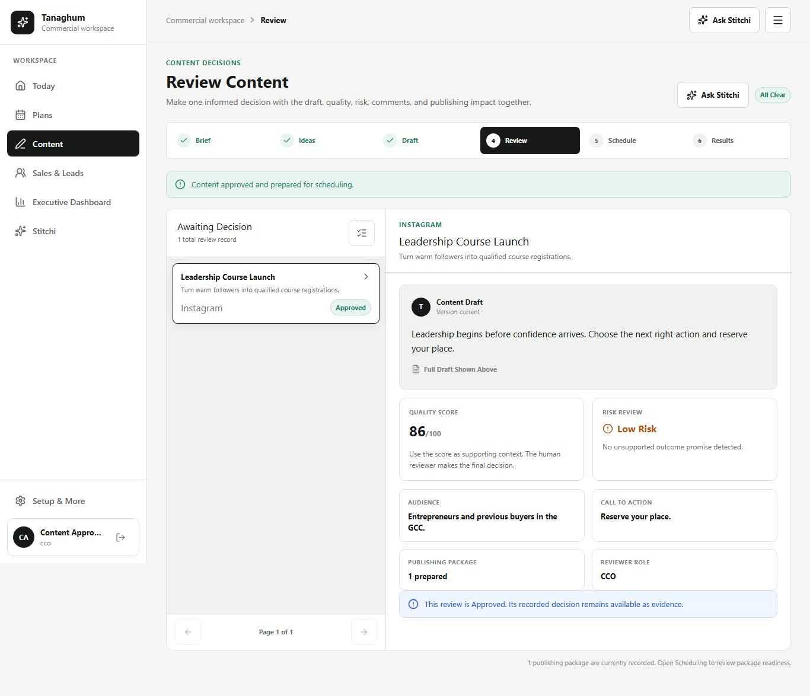
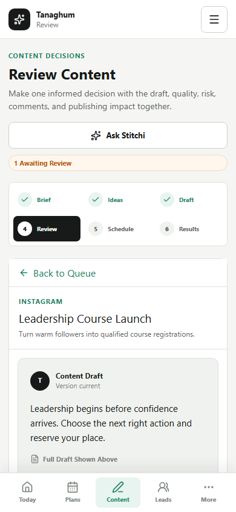
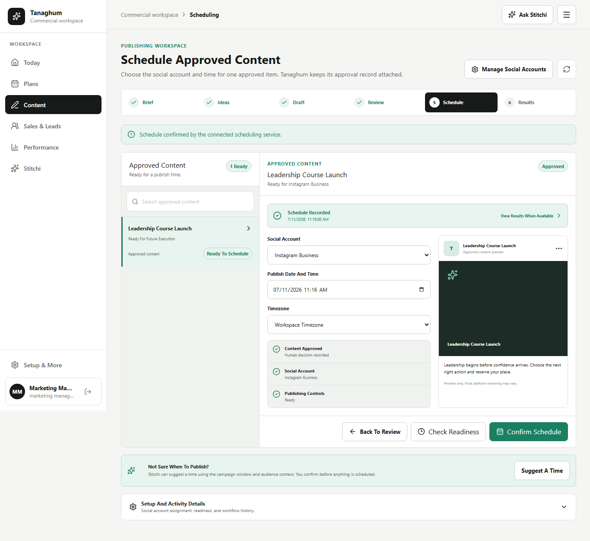
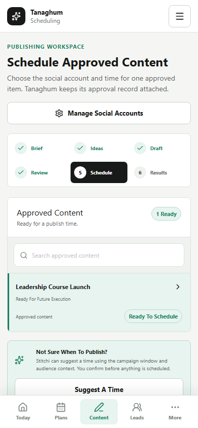
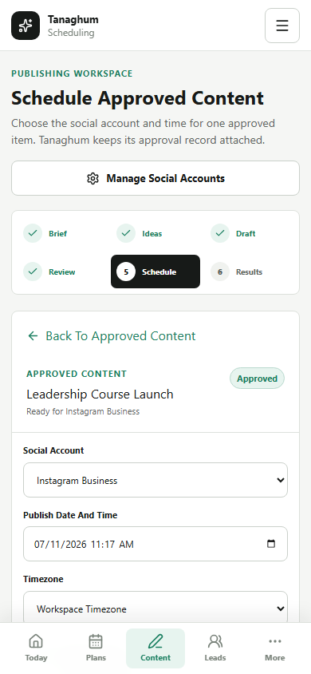

# UX-R1D3 Connected Content Lifecycle

Status: **production wiring verified locally; Hybrid deployment not performed**.

Tracking: [GitHub issue #153](https://github.com/tamerabuhalaweh/Tanaghom/issues/153), child delivery slice of [UX-R1 #145](https://github.com/tamerabuhalaweh/Tanaghom/issues/145).

## Scope Guardrails

- Hybrid only.
- The AB application is untouched.
- The approved static references remain available at `/ux/r1d3/content`, `/ux/r1d3/review`, and `/ux/r1d3/scheduling`.
- Production Content, Review, and Scheduling now use the approved connected journey.
- Existing tenant, RBAC, audit, approval, connector, and external-execution controls remain authoritative.
- No external publishing gate was enabled by this work.
- No deployment is claimed by this document.

## Connected Journey

`Brief -> Ideas -> Draft -> Review -> Schedule -> Results`

### Content

- One active task surface for the current Brief, Ideas, or Draft stage.
- Real AI-provider readiness and idea-generation APIs.
- Explicit human direction selection before campaign creation.
- Campaign creation automatically prepares the first platform draft.
- Saved campaigns can reopen their latest tenant-scoped draft versions.
- Draft editing, version save, quality scoring, and review submission stay in one workspace.
- Recent Content remains a bounded secondary continuation list.
- Stitchi is contextual to the current content task.

### Review

- Bounded queue plus one selected decision context.
- Draft, quality, risk, audience, CTA, package context, and reviewer role appear together.
- Marketing and specialist roles can read decision context without unauthorized decision controls.
- Admin and CCO retain the current backend-authorized decision controls.
- Approval prepares the internal scheduling package when one does not already exist.
- Approval remains recorded even if later package preparation needs attention.

### Scheduling

- Bounded approved-content queue plus one selected scheduling task.
- Social account, date/time, timezone, readiness, and content preview appear together.
- Readiness is checked before scheduling.
- Scheduling executes only when the backend safety gate permits it.
- Social-account assignment, connection status, and activity records remain available under secondary details.
- Mobile uses list -> detail -> back without a competing side panel.

## Production Evidence

### Content Desktop

### Review Desktop

### Review Mobile Read-Only Role

### Scheduling Desktop

### Scheduling Mobile Queue

### Scheduling Mobile Detail

## Approved Reference Evidence

The approved pre-wiring references remain committed for traceability:

- `reference-content-desktop.png`
- `reference-content-mobile.png`
- `reference-review-desktop.png`
- `reference-review-mobile-list.png`
- `reference-review-mobile-detail.png`
- `reference-scheduling-desktop.png`
- `reference-scheduling-mobile-list.png`
- `reference-scheduling-mobile-detail.png`

## Governance Preserved

- Stitchi prepares or summarizes work; it does not silently approve or publish.
- AI generation remains dependent on a configured tenant provider.
- Human direction selection remains explicit.
- Human review remains explicit.
- Decision controls remain role-gated by backend policy.
- Social account and schedule require deliberate confirmation.
- External scheduling remains denied unless production authorization and deployment gates permit it.
- API responses expose saved draft content, not secret provider credentials.

## Verification

### Backend And Build

- Backend lint: passed.
- Backend typecheck: passed.
- Backend build: passed.
- Backend regression: **1,939/1,939 passed** across 136 files.
- Frontend lint: passed.
- Frontend TypeScript/Vite build: passed.
- Existing bundle-size warning remains: the main frontend bundle is approximately 932 KB before gzip. This is separate optimization debt.

### Browser QA

- UX-R1B, UX-R1D2, UX-R1D3 production, and UX-R1D3 reference: **17/17 passed**.
- Full Playwright inventory: **38 passed, 12 environment-gated live tests skipped, 0 failed**.
- Production paths verify:
  - marketing manager Brief -> Ideas -> Draft -> quality -> Review submission;
  - marketing manager read-only Review behavior;
  - CCO approval and scheduling-package preparation;
  - approved content readiness and governed scheduling;
  - mobile Scheduling queue -> detail -> back.
- Covered browser paths report no unexpected API requests, failed API responses, console errors, console warnings, or horizontal overflow.
- Static reference width matrix covers 390, 768, 1024, 1366, and 1440 pixels.
- Visible form controls and command buttons in the reference suite meet the 44px target.

## Remaining Release Gate

1. Commit and push the production wiring.
2. Require GitHub CI to pass on the production commit.
3. Mark the PR ready for review only after CI evidence is attached.
4. Merge and deploy Hybrid only after explicit product-owner approval.
5. Run live Hybrid network, console, role, responsive, and external-execution safety checks after deployment.

AB remains isolated throughout.
