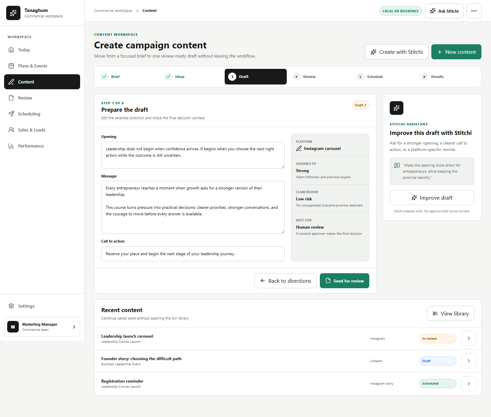
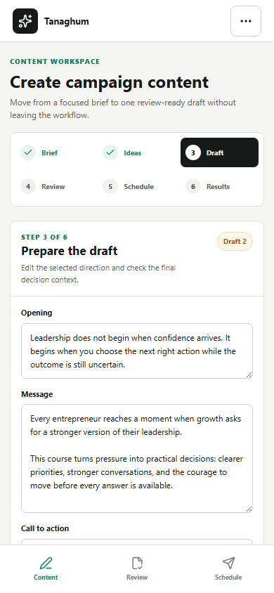
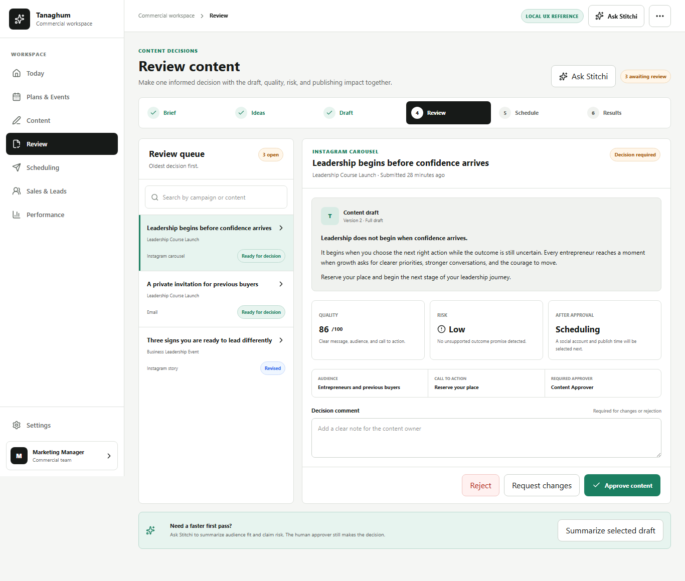
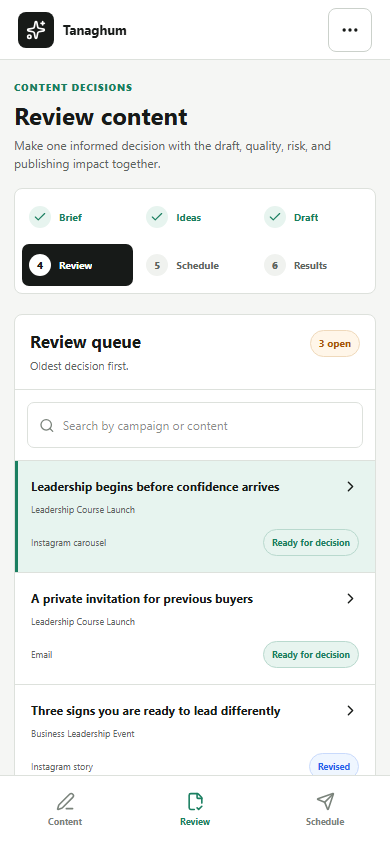
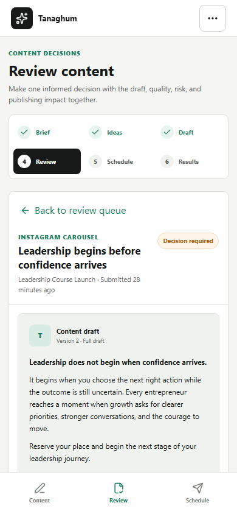
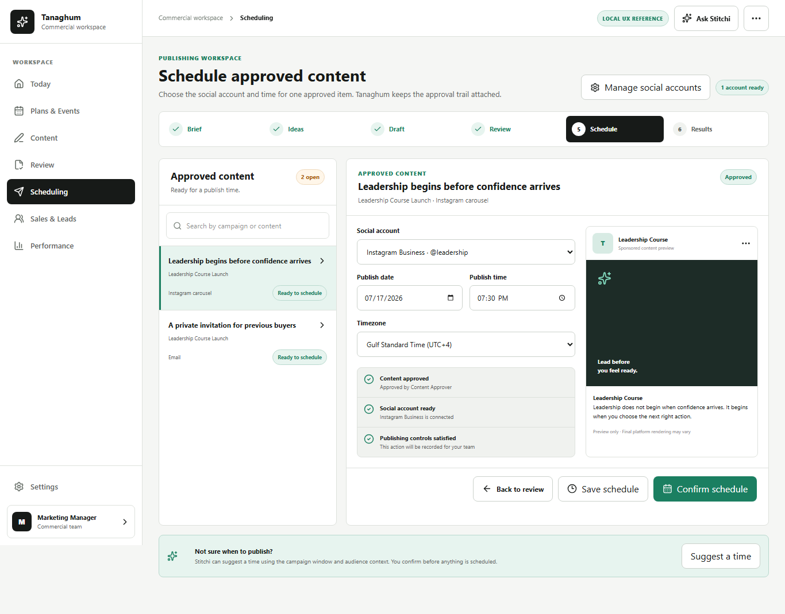
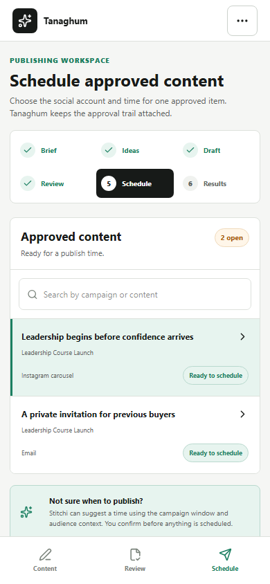
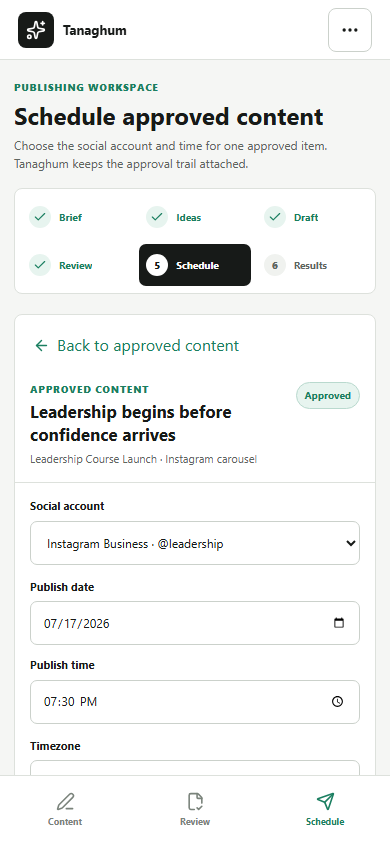

# UX-R1D3 Connected Content Lifecycle Reference

Status: **reference ready for product-owner approval; production routes unchanged**.

Tracking: [GitHub issue #153](https://github.com/tamerabuhalaweh/Tanaghom/issues/153), child delivery slice of [UX-R1 #145](https://github.com/tamerabuhalaweh/Tanaghom/issues/145).

## Scope Guardrails

- Hybrid only.
- The AB application is untouched.
- `/ux/r1d3/content`, `/ux/r1d3/review`, and `/ux/r1d3/scheduling` are static reference routes.
- Reference routes do not call Tanaghum APIs or external providers.
- Existing production Content, Review, Scheduling, backend, RBAC, tenant, audit, approval, connector, and publishing behavior is unchanged.
- Production implementation starts only after product-owner screenshot approval.

## Current Experience Audit

The production contracts are valuable, but the customer journey is split across module boundaries:

- Content brief and AI directions live in Content.
- Campaign creation, drafting, scoring, approval submission, and package preparation live in Campaigns.
- Human decisions live in Review.
- Channel readiness, connector details, package preview, and scheduling live together in Scheduling.
- Content Library competes with the active creation task.

The result is a workflow users must reconstruct themselves.

## Proposed Journey

`Brief -> Ideas -> Draft -> Review -> Schedule -> Results`

### Content

- One active task surface.
- Required brief first; optional context later.
- Comparable AI directions with human selection.
- Draft editor and review-readiness context together.
- Stitchi improves the current task, not the entire page.
- Recent Content is a bounded secondary continuation list.

### Review

- Bounded queue plus selected decision context.
- Full draft, quality, risk, audience, CTA, required approver, comment, and next state together.
- Mobile uses list -> detail -> back.
- Human approval remains mandatory.

### Scheduling

- Bounded approved-content queue plus selected scheduling form.
- Social account, date, time, timezone, readiness, and content preview together.
- Connector mechanics move behind Manage Social Accounts.
- Scheduling is never implied before the user confirms and governance permits it.
- Mobile uses list -> detail -> back.

## Reference Screens

Screenshots are generated by the isolated Playwright suite after lint and build pass.

### Content Desktop



### Content Mobile



### Review Desktop



### Review Mobile Queue



### Review Mobile Detail



### Scheduling Desktop



### Scheduling Mobile Queue



### Scheduling Mobile Detail



## Governance Preserved In The Reference

- Stitchi prepares or summarizes work; it does not silently approve or publish.
- Human direction selection remains explicit.
- Human review remains explicit.
- Reviewer role is visible in decision context.
- Social account and schedule require a deliberate confirmation.
- Production external-execution controls are not changed by this reference.

## Verification

Reference test command:

```powershell
$env:UX_CAPTURE='1'; npx playwright test e2e/ux-r1d3-reference.spec.ts
```

Required evidence:

- Frontend lint and production build pass.
- Five Playwright scenarios pass.
- Widths 390, 768, 1024, 1366, and 1440 pass without horizontal overflow.
- Visible form controls and command buttons are at least 44px.
- No browser console errors or warnings.
- No Tanaghum API calls from static reference routes.
- No sprint, acceptance, MCP, M5, SAIF, payload, integration-ID, sandbox-execution, or evidence-coverage language.

## Approval Gate

The product owner must approve these screenshots before production wiring begins. Reference completion does not mean the production routes have changed or the Hybrid VPS has been deployed.
